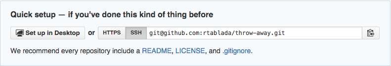
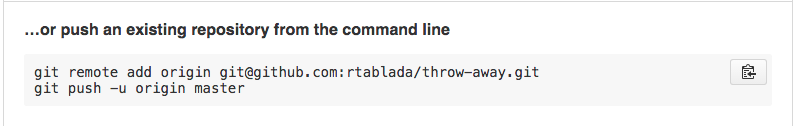

# Introduction to Github Repositories

By now you should have a Github account created and you should have your profile updated with a profile picture and your full name.
Now we need to start putting this account to use and getting ready to turn in our first homework assignment.

## Repositories

Github repositories are what we call "remotes" when working with git.
They can receive the snapshots you make with git on your local machine, store them and then make those git commits available for team members and Open Source contributors to comment on, pull down, and submit their own help.

But, before we can send any code up to Github we need to make our first repository!

From any page on Github click on the plus in the top right and this will let you create a "New Repository".
Once you have clicked this link you will be prompted for the name of your new repository.

## Working With Remotes

Now that we have somewhere for our code to go, we need to tell our local git project where it should connect to on Github.
Our repo can connect to multiple remotes at once, but for now let's just start with one.

To connect to a new remote you will run `git remote add {{remote_name}} {{remote_url}}`.
For example if I wanted to connect a local project to the class assignment repository I could run:

    git remote add origin git@github.com:TIY-LR-FEE-2015-June/assignments.git

> **NOTE** When working with remote URLs and github there are two options for how we can connect: SSH or HTTPS.
> HTTPS will ask for your username and password every time you try to send and receive code.
> SSH will use the SSH fingerprint we set up on day 0 so that we don't need to enter our password every time.
> Make sure that you always select SSH when working on your usual development machine (HTTPS can be handy if you need to work on one or two commits on someone else's machine).

The buttons at the top of your repository setup page will look like this if you have SSH active:

## Adding a remote and sending your `master` branch to Github

When you are greeted with the setup screen and you haven't sent any code to Github, there will be two sections: "create a new repository on the command line" and what we care about which is "push an existing repository from the command line".

Under this section you will see the two commands that you can run to both add a new remote to your new repository AND push your code from the `master` branch.
You could highlight all of this yourself OR, you can click on the handy dandy clipboard button which will add these commands to your clipboard.
Now just paste in the terminal and hit `Enter` to run these commands.

## New Branches

Now that we have our boilerplate code committed on `master` and up on Github we need to start a new `develop` branch.

We build a new branch as a way to get prepared for working in teams and when working on multiple features at a time.
This `develop` branch (or any new branch) let's us keep the work on `master` clean and we will only add things to our `master` branch when they are ready for launch.
This idea means that at ANY time the `master` branch should be ready to go and public on the main site we are working on.
By working on `develop` we not only give ourselves the chance to revert back to the last clean and working version of our site, but we can also reduce some of the pressure of always having to make production ready code (as is a good practice on the `master` branch).

Enough babbling, how do we create our new `develop` branch?

To add a new branch we can run `git branch {{branch_name}}`.
This will create a new branch from our latest git commit.
But it does not switch us over to this new branch, so if we commit anything right now, it will still be committed on the `master` branch.

## Switching Branches

We need to switch our branch over to the new `develop` branch so we can continue on with our work.
When you switch to a different branch or commit, this is called "checking out" our code using the `git checkout` command from the console.
So to checkout `develop` we will run:

    git checkout develop

## Shortcut 

Creating and moving to a new branch is a very common task so there is of course a shortcut for this.

By running `git checkout -b develop` we are telling git to move to `development` and by adding `-b` we are telling git that it should make a new branch if one doesn't already exist.
